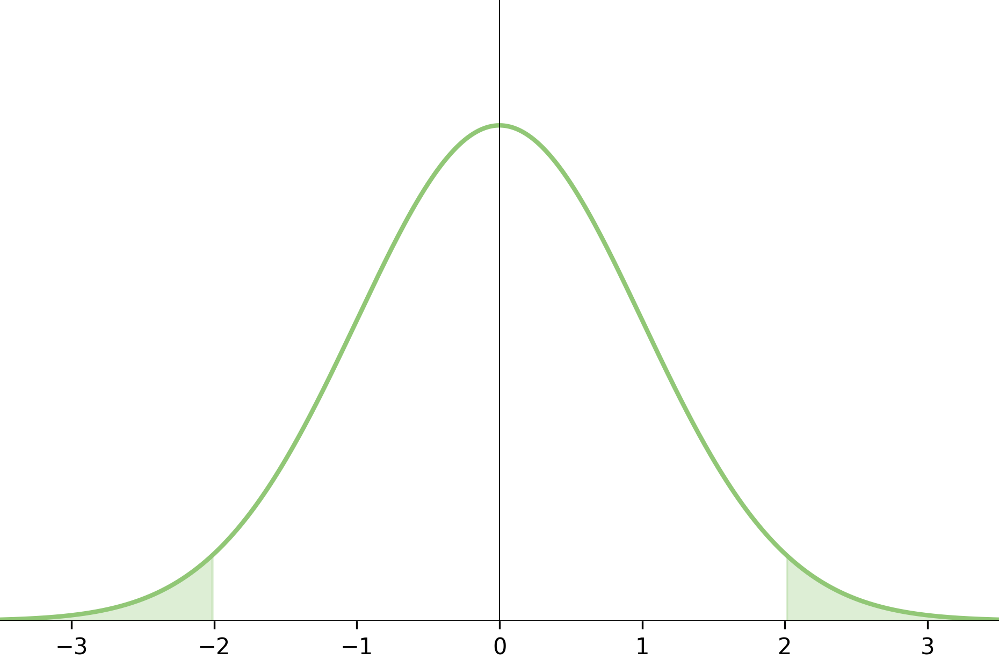

    <h1 align="center">Machine Learning Course - Spring 2025</h1>
    
Repository for <a href="https://www.via.dk/">MAL1-S25</a> at VIA
 <!-- NOTE: MISSING LINK -->
    
<strong><a href="https://rbrooksdk.github.io/MAL1_25">Checkout the homepage!</a></strong>

  

## :fontawesome-solid-circle-info:{ .fa-circle-info} Course information

* Course responsible: Associate Professor [Richard Brooks](https://rbrooksdk.github.io), <rib@via.dk>
* 5 ECTS (European Credit Transfer System), corresponding to 130 hours of work
* Bachelor level course - the course is academically challenging working on problems independently.
* Grade: 7-step scale
* Recommended prerequisites: In "Sessions" in the left menu, a dedicated entry is made for prerequisites.

## :fontawesome-solid-vector-square:{ .fa-vector-square} Lectures and course organization

1. At the beginning of each session, there will be a short recap of the previous session.
2. We then go through the exercises from the previous session.
3. We will go through the theory of the current session.
4. After classes, and before the next session, you will have to solve exercises from the current session.

This then loops back to (1) at the beginning of the next session.

There are no mandatory assignments, but it is highly recommended to work on the exercises for each session. No instruction is provided for the exercises so you will have to work on them on your own or form study groups.

